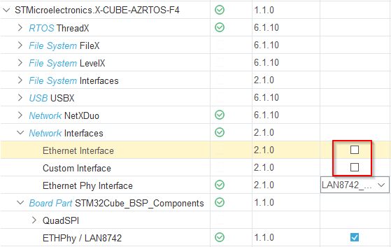

# Stm32NetX

This library manages the basic network tasks for Netx (ThreadX) in a OOP way.


## Requirements

* ThreadX (Core) (Memory pool size: 5*1024)
* NetX (NX Core, Ethernet Interface, Ethernet Phy Interface) (Memory pool size: 35*1024)
* HAL ethernet configuration (MAC address?)
* Stm32ItmLogger
* Stm32Common
* Stm32ThreadX


## Installation

In file `NetXDuo/App/app_netxduo.c` add the following:

```c
/* USER CODE BEGIN Includes */
#include <main.h>
#include "Stm32NetXCPPWrapper.hpp"
/* USER CODE END Includes */


// ... //


/* USER CODE BEGIN MX_NetXDuo_Init */

// Jump to our C++ NetX thread setup function
ret = Stm32NetX_setup(byte_pool);
assert_param(ret == TX_SUCCESS);

// ... //

/* USER CODE END MX_NetXDuo_Init */
```


### STM32CubeMX

Do not include the Ethernet Interface, Stm32NetX has a modified version of the driver.




